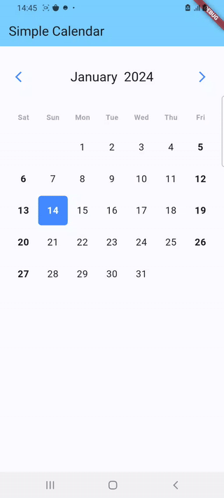
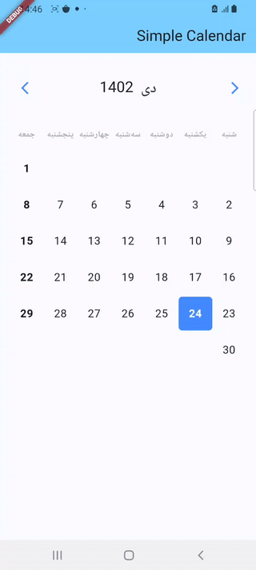

# simple_clean_calendar

Simple calendar

# Simple Clean Calendar

A simple calendar with left right arrow to change month!

Supported calendar:
- Gregorian calendar
- Shamsi (Solar) calendar




## Installation

Add

```bash
simple_clean_calendar: 0.1.0
```

to your `pubspec.yaml` and run

```bash
flutter pub get
```

in the project's main folder.

## Parameters

### SimpleCalendar

| Parameter                         | Type                                                                                                                                                                          | Default                                                 | Description                                                                                                                                                                                                                                                            |
|:----------------------------------|:------------------------------------------------------------------------------------------------------------------------------------------------------------------------------| :------------------------------------------------------ | :--------------------------------------------------------------------------------------------------------------------------------------------------------------------------------------------------------------------------------------------------------------------- |
| SimpleCalendarController          | SimpleCalendarController                                                                                                                                                      | **required**                                            | The controller of ScrollableCleanCalendar                                                                                                                                                                                                                              |
| locale                            | String                                                                                                                                                                        | en                                                      | The language locale                                                                                                                                                                                                                                                    |
| showWeekdays                      | bool                                                                                                                                                                          | true                                                    | If is to show or not the weekdays in calendar                                                                                                                                                                                                                          |
| spaceBetweenMonthAndCalendar      | double                                                                                                                                                                        | 24                                                      | The space between month and calendar                                                                                                                                                                                                                                   |
| spaceBetweenCalendars             | double                                                                                                                                                                        | 24                                                      | The space between calendars                                                                                                                                                                                                                                            |
| initialFocusDate                  | DateTime                                                                                                                                                                      | null                                                    | Initial date that the calendar scroll should focus when open                                                                                                                                                                                                           |
| scrollToMonth                     | Function({required DateTime date, double alignment = 0, required Duration duration, Curve curve = Curves.linear, List\<double> opacityAnimationWeights = const [40, 20, 40]}) | null                                                    | Animate the list over `duration` using the given `curve` such that the item at `index` ends up with its leading edge at the given `alignment`.                                                                                                                         |
| calendarCrossAxisSpacing          | double                                                                                                                                                                        | 4                                                       | The horizontal space in the calendar dates                                                                                                                                                                                                                             |
| calendarMainAxisSpacing           | double                                                                                                                                                                        | 4                                                       | The vertical space in the calendar dates                                                                                                                                                                                                                               |
| padding                           | EdgeInsetsGeometry                                                                                                                                                            | EdgeInsets.symmetric(horizontal: 16, vertical: 32)      | The parent padding                                                                                                                                                                                                                                                     |
| monthTextStyle                    | TextStyle                                                                                                                                                                     | Theme.of(context).textTheme.headline6                   | The label text style of month                                                                                                                                                                                                                                          |
| monthTextAlign                    | TextAlign                                                                                                                                                                     | TextAlign.left                                          | The label text align of month                                                                                                                                                                                                                                          |
| weekdayTextStyle                  | TextStyle                                                                                                                                                                     | Theme.of(context).textTheme.bodyText1                   | The label text align of month                                                                                                                                                                                                                                          |
| dayTextStyle                      | TextStyle                                                                                                                                                                     | Theme.of(context).textTheme.bodyText1                   | The label text style of day                                                                                                                                                                                                                                            |
| daySelectedBackgroundColor        | Color                                                                                                                                                                         | Theme.of(context).colorScheme.primary                   | The day selected background color                                                                                                                                                                                                                                      |
| dayBackgroundColor                | Color                                                                                                                                                                         | Theme.of(context).colorScheme.surface                   | The day background color                                                                                                                                                                                                                                               |
| daySelectedBackgroundColorBetween | Color                                                                                                                                                                         | Theme.of(context).colorScheme.primary.withOpacity(.3)   | The day selected background color that is between day selected edges                                                                                                                                                                                                   |
| dayDisableBackgroundColor         | Color                                                                                                                                                                         | Theme.of(context).colorScheme.surface.withOpacity(.4)   | The day disable background color                                                                                                                                                                                                                                       |
| dayDisableColor                   | Color                                                                                                                                                                         | Theme.of(context).colorScheme.onSurface.withOpacity(.5) | The day disable color                                                                                                                                                                                                                                                  |
| dayRadius                         | double                                                                                                                                                                        | 6                                                       | The radius of day items                                                                                                                                                                                                                                                |
| monthBuilder                      | Widget Function(BuildContext context, String month)                                                                                                                           | null                                                    | A builder to make a customized month                                                                                                                                                                                                                                   |
| weekdayBuilder                    | Widget Function(BuildContext context, String weekday)                                                                                                                         | null                                                    | A builder to make a customized weekday                                                                                                                                                                                                                                 |
| dayBuilder                        | Widget Function(BuildContext context, DayValues values)                                                                                                                       | null                                                    | A builder to make a customized day of calendar                                                                                                                                                                                                                         |

### SimpleCalendarController
 
| Parameter               | Type                                          | Default         | Description                                             |
| :---------------------- | :-------------------------------------------- | :-------------- | :------------------------------------------------------ |
| minDate                 | DateTime                                      | **required**    | Obrigatory: The mininimum date to show                  |
| maxDate                 | DateTime                                      | **required**    | Obrigatory: The maximum date to show                    |
| initialDateSelected     | DateTime                                      | null            | An initial selected date                                |
| endDateSelected         | DateTime                                      | null            | The end of selected range                               |
| weekdayStart            | int                                           | DateTime.monday | In what weekday position the calendar is going to start |
| onDayTapped             | Function(DateTime date)                       | null            | Function when a day is tapped                           |
| onRangeSelected         | Function(DateTime minDate, DateTime? maxDate) | null            | Function when a range is selected                       |
| onPreviousMinDateTapped | Function(DateTime date)                       | null            | When a date before the min date is tapped               |
| onAfterMaxDateTapped    | Function(DateTime date)                       | null            | When a date after max date is tapped                    |
| readOnly                | bool                                          | false           | If the Calendar Widget is on read-only mode             |

```dart
SimpleCalendarController(
  onDayTapped: (date) {
    debugPrint('on day tapped is: $date');
  },
  onChangeMonthTapped: (sDate, eDate) {
    debugPrint('Start date is: $sDate and end date is: $eDate');
  },
  weekdayStart: DateTime.monday,
);
```
 
```dart
SimpleCalendar(
  calendarController: calendarController,
  layout: Layout.beauty,
  calendarCrossAxisSpacing: 0,
  locale: const Locale('en').languageCode, // Change `en` to `fa` to test Shamsi calendar
  daySelectedBackgroundColor: Colors.blueAccent,
),
```